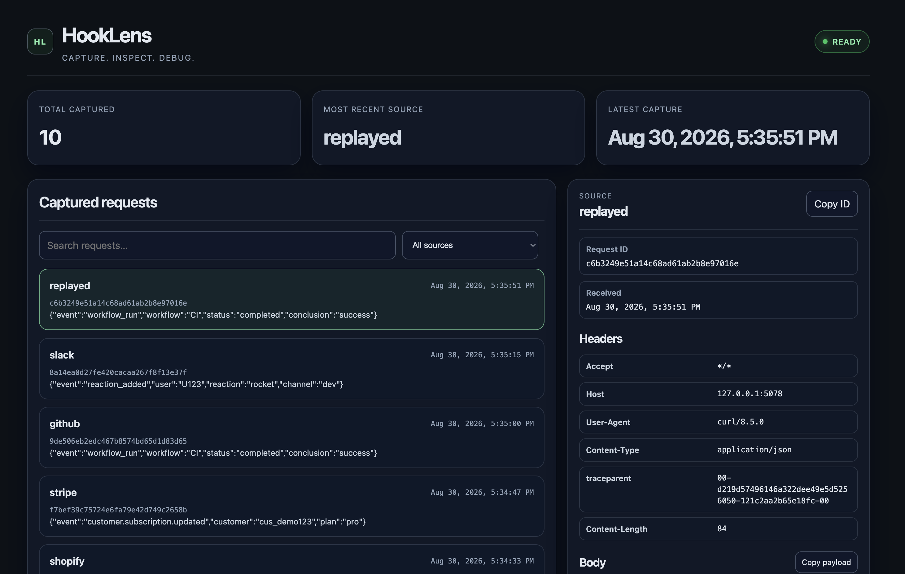
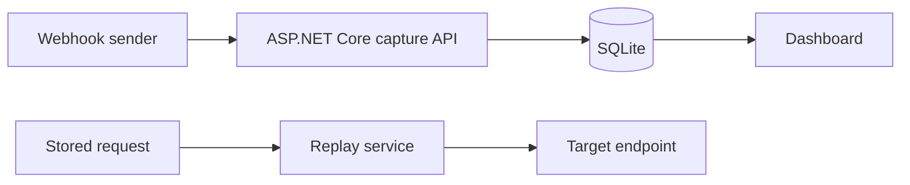

# HookLens

[](https://github.com/JPatoChan/HookLens/actions/workflows/ci.yml)

HookLens is a lightweight .NET developer tool for capturing, inspecting, and replaying webhook requests. It exists to make local integration debugging visible: send a webhook to HookLens, inspect its raw headers and body, then replay it against a development endpoint when needed.

## Features

- Capture webhook requests by source through an HTTP API
- Persist captured requests in SQLite across restarts
- Inspect request metadata, headers, raw bodies, and formatted JSON in the dashboard
- Search request content and filter by source
- Replay a stored request to an explicit HTTP or HTTPS destination
- Run locally or in a Docker container with a mounted SQLite data path
- Verify changes with GitHub Actions CI and automated integration tests

## Dashboard



## Tech Stack

- .NET 10 and ASP.NET Core minimal APIs
- Entity Framework Core 10 with SQLite
- Static HTML, CSS, and JavaScript dashboard
- xUnit and `WebApplicationFactory` integration tests
- Docker multi-stage builds and GitHub Actions

## Architecture



## Run Locally

Prerequisite: .NET SDK 10.0 or later.

From the repository root:

```bash
dotnet restore
dotnet build
dotnet run --project src/HookLens/HookLens.csproj --urls http://localhost:5078
```

Open [http://localhost:5078/](http://localhost:5078/) to use the dashboard. Without a configured connection string, the app stores data in `hooklens.db` in its current working directory.

## Run with Docker

Build the image and run HookLens on port 8080 with persistent SQLite storage:

```bash
docker build -t hooklens .
docker run --rm -p 8080:8080 \
  -v "$(pwd)/data:/data" \
  --name hooklens \
  hooklens
```

Open [http://localhost:8080/](http://localhost:8080/). The container uses `/data/hooklens.db`; mounting `/data` keeps captures after the container is removed.

## API

- `GET /` - dashboard
- `GET /health` - health response
- `GET /status` - service metadata and readiness
- `POST /capture/{source}` - capture a request body and headers
- `GET /requests` - list captures, newest first; supports `source` and `q` filters
- `GET /requests/{id}` - retrieve one capture
- `POST /requests/{id}/replay` - replay a capture to an absolute HTTP or HTTPS URL

Example capture and filtered list:

```bash
curl -X POST http://localhost:5078/capture/github \
  -H "Content-Type: application/json" \
  -d '{"event":"ping","ok":true}'

curl "http://localhost:5078/requests?source=github&q=ping"
```

## CI

The workflow in `.github/workflows/ci.yml` runs on pushes to `main` and pull requests targeting `main`. It installs .NET 10, restores dependencies, builds the solution in Release mode, and runs the complete test suite.

## Screenshots

The dashboard is served directly from `src/HookLens/wwwroot`. Screenshots are intentionally not included yet because this environment does not provide a reliable browser capture tool; clean populated dashboard screenshots should be added under `docs/assets/` before a public portfolio release.

## Release Notes: v1.0.0

- Added HTTP webhook capture with source labeling and raw request preservation.
- Added SQLite persistence with startup migrations and newest-first request inspection.
- Added dashboard views for headers, bodies, JSON, search, and source filtering.
- Added explicit webhook replay to user-selected HTTP or HTTPS destinations.
- Added Docker support with persistent `/data` storage.
- Added GitHub Actions CI and automated integration coverage.

HookLens is intended for local and test development use. It is not a production-grade relay, broker, or authenticated webhook gateway.
